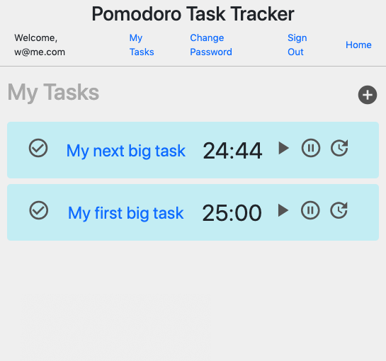

# Capstone Pomodoro Task Tracker Client

## Links

[Production Application Client](https://matthewjmontalto.github.io/capstone-pomodoro-task-tracker-client/#/) |
[Production Application API](https://pomodoro-task-tracker-api.herokuapp.com/) |
[Application API Repository](https://github.com/matthewjmontalto/capstone-pomodoro-task-tracker-api)

## Description

The pomodoro task tracker allows users to create an account and track their
daily tasks. When the time comes to begin working on a task, a user can utilize
a timer that complies with the pomodoro time management strategy. The timer
will start at 25 minutes. When the timer expires, it will switch to a 5-minute break
period. Then, when the break period expires, the timer will switch back to a
25-minute countdown, signifying the next pomodor round. Users may utilize
however many rounds necessary to complete a task.

When creating a task, users must provide a title, description, and date.
Optional fields include a difficulty level, which will store any number provided,
so as to allow for flexibility.

Tasks may be edited or deleted at any time when viewing the detail screen for a
given task. However, tasks may be switched to completed while viewing the task
from the task list.

## Technologies In Use

### Client
-   React.js
-   React-Router
-   React-DOM
-   JavaScript
-   JSX
-   HTML5 & SCSS
-   React-Bootstrap
-   Axios
-   Material Icons

## Unsolved Problems

1.  The timer for a given task will reset if the component unmounts at any point. Integrating Redux or MobX to support a persistent state would allow for a continuous countdown.
2.  When a timer expires, a patch request is sent to the server to update the number of rounds. Serving this action when the component unmounts would be more efficient, but this can be inturrupted. Future state will involve a means to pause the unmount until the api returns a response.
3.  The application layout is not responsive
4.  the application does not currently meet minimum accessibility standards

## Planning, Process, and Problem Solving

It was determined from the outset of the project that the client would be built using React. The initial plan began by deciding what type of database would best support the nature of data produced by this application. Given the predictable nature of the data, a relational database supported by Ruby on Rails was chosen.

Establishing the databse and setting up the back-end of the application came first, as this would determine how the client would connect to the available routes. Curl scripts were used to test the routes on th eback end and generate a user.

After the back-end was established, work on the front end began with connecting crud actions to the databse. Once actions were verified to work using curl scripts, basic components were built to begin displaying data.

Any problems or challenges that occurred were addressed immediately using a number of methods:
-   debugging and logging data to the console.
-   researching error messages
-   reviewing documentation
-   searching stack overflow for similar issues

## Wireframes

## User Stories
1.  Create an account
2.  Sign in to my account
3.  Manage my account details
4.  Sign out of my account
5.  Create a task
6.  Use a 1 – 3 difficulty scale to rate a task
7.  Update a task
8.  Delete a task
9.  Review past tasks
10.	Track whether a task was completed or not.
11.	Use the Pomodoro technique of time management, while completing a task
12.	View a timer that will count down the time during a work session or rest period
13.	Be prevented from interfacing with tasks during a rest period
14.	Take a 15-minute break after every four pomodoros
15.	Tally the aggregate difficulty level of my completed tasks
16.	Set a goal for difficulty points to reach by completing various tasks
17.	View my task completion history per day
18.	Provide motivational quotes during rest periods

## Screenshot

## Set-up

1.  fork and clone this repository
2.  navigate to the project directory and run `git init`
2.  Open your terminal and run `npm install` to install dependencies
3.  Entering `npm run start` in to the terminal will establish a local development server and should also open a browser tab. Or, you can navigate your browser to `http://localhost:7165/`
4.  Additionally, run these commands often:
  - `npm run make-standard`: reformats code in the standard javascript style
  - `npm run build`: bundles styles and scripts to be references by index.htmls
